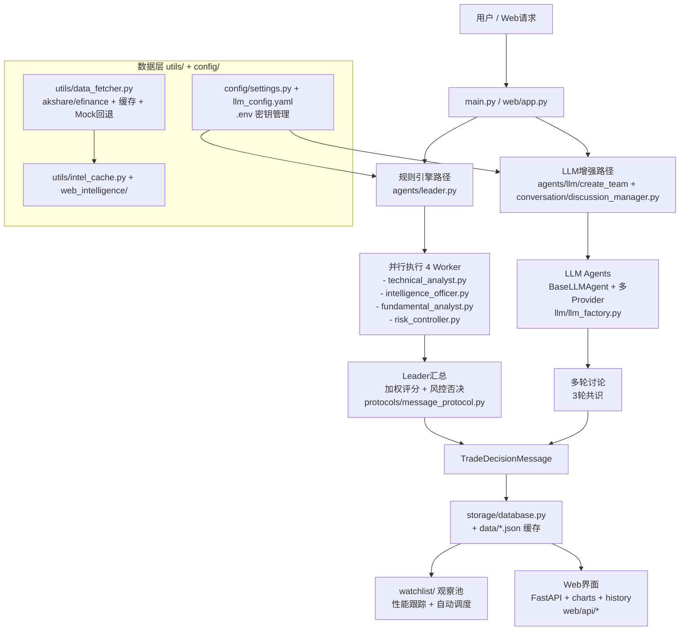

# 中短线波段 Agent Team 系统

## 系统概述

这是一个基于多Agent协作的股票中短线交易决策系统，通过技术分析、情报分析、基本面分析和风控评估四个维度的综合判断，输出可执行的交易指令。

**特色：**
- 日K线 + 周K线双周期分析
- 多数据源支持（akshare + efinance）
- 网络故障时自动切换模拟数据
- 重试和缓存机制保证稳定性

## 系统架构（更新后）

系统支持**两条并行分析路径**：
1. **规则引擎路径**：确定性强、解释性好（leader + 4个Worker并行）。
2. **LLM增强路径**：通过`agents/llm/`和`conversation/discussion_manager.py`实现多轮讨论和结构化输出。



**关键改进点**：
- 安全：所有密钥通过 `.env` + `api_key_env` 机制（已清理明文密钥）
- 鲁棒性：数据获取失败自动mock，Worker异常有日志
- 可扩展：Web API、Watchlist定时任务、Vercel Serverless支持
```

## 安全与配置（新增）

**API Key 配置（必须）**：

1. 复制模板：
   ```bash
   cp .env.example .env
   ```

2. 编辑 `.env` 填入您的密钥（从DMXAPI或其他提供商获取）：
   ```
   OPENAI_API_KEY=sk-your-key-here
   # 其他如 ZHIPU_API_KEY, QWEN_API_KEY 等
   ```

3. 系统会自动加载（`python-dotenv` + `config/config_loader.py`）。

**注意**：`.env` 已加入 `.gitignore`，**绝不提交到Git**。历史中出现的密钥已在当前代码中完全移除。

## 目录结构（当前实际结构）

```
stock_agent_team_proj/
├── README.md                    # 系统说明（已更新）
├── main.py                      # CLI入口与StockAgentTeam
├── requirements.txt             # 依赖清单（新增 python-dotenv）
├── .env.example                 # API密钥模板（**不要提交真实密钥**）
├── .env                         # 本地配置（已加入 .gitignore）
├── config/                      # 配置模块
│   ├── settings.py              # 权重、阈值、路径配置
│   ├── llm_config.yaml          # LLM提供商配置（使用 api_key_env）
│   ├── intel_config.py
│   ├── config_loader.py         # 智能配置加载器
│   └── __init__.py
├── agents/                      # Agent核心
│   ├── base_agent.py
│   ├── leader.py                # 规则引擎决策中枢
│   ├── technical_analyst.py
│   ├── intelligence_officer.py
│   ├── fundamental_analyst.py
│   ├── risk_controller.py
│   ├── review_analyst.py
│   ├── llm/                     # LLM Agent实现（parallel to rule-based）
│   └── web_intelligence/        # 网络情报采集
├── llm/                         # LLM基础设施
│   ├── llm_factory.py
│   ├── base_provider.py
│   ├── providers/               # 多厂商适配（qwen, zhipu, deepseek, moonshot, openai_compatible）
│   └── examples.py
├── web/                         # Web界面与API
│   ├── app.py                   # FastAPI应用
│   ├── api/                     # REST路由（analyze, watchlist, history, charts, scheduler, intel, performance, kline）
│   └── static/                  # 前端JS和HTML
├── watchlist/                   # 观察池系统
│   ├── watchlist_manager.py
│   ├── data_collector.py
│   ├── performance_tracker.py
│   ├── auto_scheduler.py
│   ├── stock_screener.py
│   └── test_watchlist.py
├── conversation/                # 多轮讨论管理
│   ├── discussion_manager.py
│   ├── prompts.py
│   └── message.py
├── protocols/                   # 消息协议
│   └── message_protocol.py
├── storage/                     # 存储
│   └── database.py              # SQLite操作（schema.sql）
├── utils/                       # 工具
│   ├── data_fetcher.py          # 多源数据+缓存+mock（核心模块）
│   ├── intel_cache.py
│   ├── logger.py
│   ├── freshness_checker.py
│   └── intel_searcher.py
├── models/                      # 基础模型
│   └── base.py
├── tests/                       # 测试
├── deploy/                      # 部署（docker-compose.yml）
├── docs/                        # 文档（LOCAL_DEPLOYMENT.md 已同步）
└── data/                        # 缓存、报告、情报JSON、watchlist.json
```

**安全注意**：所有API Key现在**必须通过环境变量**（.env文件）配置。`config/llm_config.yaml` 已更新为使用 `api_key_env` 字段，`config/config_loader.py` 负责从环境变量安全读取。真实密钥已从代码和 .env 中移除，并加入 `.gitignore`。

## 数据源配置

系统支持多个数据源，自动切换和重试：

| 数据源 | 状态 | 说明 |
|--------|------|------|
| akshare | ✅ 已集成 | 主要数据源，免费开源 |
| efinance | ✅ 已集成 | 备用数据源，东方财富数据 |
| 模拟数据 | ✅ 兜底 | 网络故障时自动生成确定性模拟数据 |

**数据缓存：** 5分钟缓存，减少重复请求

**重试机制：** 最多3次重试，带随机延迟

---

## 快速开始

**1. 准备配置（重要）**
```bash
cp .env.example .env
# 编辑.env填入您的API Key
pip install -r requirements.txt
```

**2. CLI 使用**
```bash
python main.py --code 300750
```

**3. Web界面**
```bash
uvicorn web.app:app --reload
# 浏览器打开 http://localhost:8000
```

**4. Watchlist和LLM测试**
```bash
python test_llm_api.py
python run_watchlist.py --help
```

详见上方「安全与配置」和「系统架构」部分。

## 权重配置

| 角色 | 默认权重 | 调整范围 |
|------|---------|---------|
| 技术分析员 | 35% | 20%-50% |
| 情报员 | 30% | 15%-45% |
| 风控官 | 20% | 15%-35% |
| 基本面分析师 | 15% | 10%-30% |

## 决策阈值

- 综合评分 ≥ 8.0：强烈买入
- 综合评分 7.0-8.0：建议买入
- 综合评分 5.0-7.0：观望
- 综合评分 < 5.0：回避
- 风控否决：不交易

## 风控规则

- 单只股票仓位上限：20%
- 单板块仓位上限：40%
- 总仓位上限：80%
- 默认止损幅度：5%-7%
- 最小盈亏比：1:1.5

---

## 部署到 Vercel（FastAPI）

本项目包含 FastAPI Web（见 `web/app.py`），可以部署到 Vercel 的 Python Functions。

### 已做的适配

- Vercel 入口：`api/index.py`
- 路由配置：`vercel.json`（把所有路径转发到同一个 Function）
- 可写目录：在 Vercel 运行时将 `SQLite/日志/报告` 写到 `/tmp`（见 `config/settings.py`）

### 你需要做的事

1. 在 Vercel 项目里配置环境变量（从 `.env.example` 迁移，别把 `.env` 提交到公网）
2. 如果需要“持久化”的数据（历史分析/观察池/交易记录），不要依赖 SQLite：
   - Vercel 的 `/tmp` 不保证持久化；建议接入外部数据库（如 Postgres）或其他持久化存储
3. 定时任务不要依赖进程内调度器常驻：
   - 建议用 Vercel Cron Jobs 定时调用 `POST /api/scheduler/run`

### 本地启动 Web

虚拟环境：stock_agent_team(项目上一级路径下)
```bash
source ../stock_agent_team/bin/activate
./start_web.sh
```
